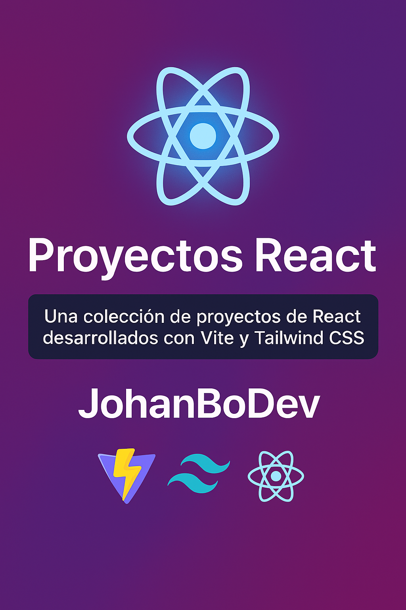

<div align="center">
  
</div>

---

# 📦 Monorepo de Proyectos React

> 🎯 Una colección creativa de **20 proyectos React** de nivel intermedio, desarrollados con **Vite** y **Tailwind CSS** para practicar, mejorar y compartir.  
> 💡 Ideal para estudiantes, autodidactas y devs que quieren construir cosas reales con `useState`.

---

## 🧩 Estructura del monorepo

Cada carpeta es un proyecto independiente con su propio código, dependencias y estilos.  
Puedes clonarlo, estudiarlo, mejorarlo o usarlo como base para tus propios retos.

---

## 🚀 Proyectos incluidos (nivel intermedio)

| #  | Proyecto                          | Estado       | Descripción breve                            |
|----|-----------------------------------|--------------|----------------------------------------------|
| 01 | TodoApp                           | ⬜ Hecho     | Crear, marcar,editar y eliminar tareas       |
| 02 | Carrito de compras                | ⬜ Por hacer | Productos con cantidad y subtotal            |
| 03 | Lista de contactos                | ⬜ Por hacer | Nombre, email, y acciones básicas            |
| 04 | Calculadora de propinas           | ⬜ Por hacer | Divide cuenta entre personas                 |
| 05 | Biblioteca de libros              | ⬜ Por hacer | Marcar libros como leídos                    |
| 06 | Rutina de ejercicios              | ⬜ Por hacer | Planifica ejercicios semanales               |
| 07 |  Gestor de gastos                 | ⬜ Por hacer | Añadir, editar, ver totales                  |
| 08 | Paleta de colores                 | ⬜ Por hacer | Selecciona y guarda colores favoritos        |
| 09 | Checklist inteligente             | ⬜ Por hacer | Marcado por secciones y progreso             |
| 10 | Sistema de puntos gamificado      | ⬜ Por hacer | Recompensas por acciones                     |
| 11 | Inventario                        | ⬜ Por hacer | Control de stock y productos                 |
| 12 | Flashcards                        | ⬜ Por hacer | Estudiar con tarjetas de memoria             |
| 13 | Ahorro mensual                    | ⬜ Por hacer | Calcula cuánto ahorrar                       |
| 14 | Posts tipo blog                   | ⬜ Por hacer | Crear, listar y eliminar posts               |
| 15 | Tracker de metas                  | ⬜ Por hacer | Seguimiento con barra de avance              |
| 16 | Juego clic rápido                 | ⬜ Por hacer | Mide tiempo de reacción                      |
| 17 | Adivina el país                   | ⬜ Por hacer | Juego de preguntas                           |
| 18 | Conversor de unidades             | ⬜ Por hacer | °C↔°F, km↔mi, etc.                           |
| 19 | Generador de tareas aleatorias    | ⬜ Por hacer | Ideas random para tareas                     |
| 20 | Calendario visual                 | ⬜ Por hacer | Marca días en calendario básico              |

---

## 🛠 Tecnologías usadas

- ⚛️ React
- ⚡ Vite
- 🎨 Tailwind CSS
- 💾 `useState` 
- 🧩 Componentes reutilizables
- 📱 Responsive design

---

## 📌 Cómo ejecutar un proyecto

```bash
cd nombre-del-proyecto
npm install
npm run dev


🧑‍💻 Autor
Johan Bohorquez – Desarrollador frontend 
📍 Colombia | 💻 En constante aprendizaje
📫 [https://www.linkedin.com/in/johanbodev/]

⭐ Contribuye
Si quieres sugerir un proyecto, corregir algo o compartir tu versión mejorada, ¡abre un issue o un PR!

🧠 Inspira. Aprende. Comparte.
"La mejor forma de aprender a programar, es programando proyectos que te reten cada día."
